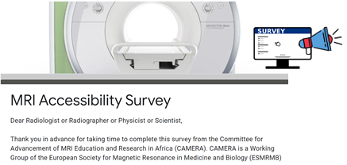
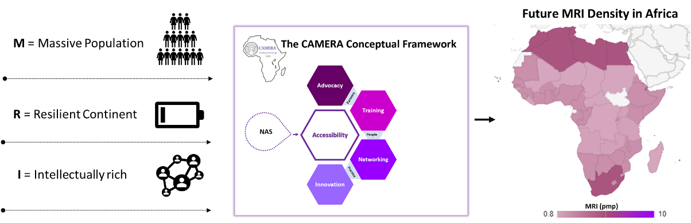

 <!-- comment 
 --> 
 

 
 

 
# CAMERA Need Assessment Survey (NAS)
The Needs Assessment Survey (NAS) was designed to identify MRI needs unique to Africa based on a pilot field survey of seven MRI facilities in Nigeria in 2020 and the RAD-AIDTM Radiology-Readiness Survey.

 

 
 

 
The aims of the NAS are to: 
1. Identify and understand needs and challenges of conducting MRI for clinical use and research in Africa.

2. Identify and understand gaps in training of highly qualified personnel in MRI research and clinical practice.

3. Create educational programs to help close gaps in training of highly qualified personnel in MRI. 

4. Create a network of MRI experts and users from Africa interested in collaborating with African MRI scientists and global partners.

5. Help our vendor partners know how to support MRI needs in Africa.  

This 15 minute survey is the first step towards achieving CAMERA's vision of reducing the disparity in MRI research capacity in Africa. If you want to complete the survey, please follow the links to do so in [English](https://docs.google.com/forms/d/e/1FAIpQLSe2wIW2Hdd_KCUYIBz8AxkwK509C0VwreAbr4od6w4cYx6mCA/viewform) or in [French](https://docs.google.com/forms/d/e/1FAIpQLSfLm9BsUgInR--O3TKu7mLM3Xj3VZb4zRaXBHUOcvGC8mrQYA/viewform?usp=sf_link). 

---
The full questionnaires are also uploaded as pdf files ([English](https://github.com/CAMERA-MRI/NAS/blob/main/CAMERA_NAS_CC4.0.pdf) and [French](https://github.com/CAMERA-MRI/NAS/blob/main/CAMERA_NAS_CC4.0_french.pdf)) to this repository for public use. If you use, modify or adapt this survey tool in your research, please cite:

[Anazodo UC, Ng JJ, Ehiogu B, Obungoloch J, Fatade A, et al., A framework for advancing
sustainable magnetic resonance imaging access in Africa. NMR Biomed. 2023 Mar;36(3):e4846.
doi: 10.1002/nbm.4846.](https://analyticalsciencejournals.onlinelibrary.wiley.com/doi/10.1002/nbm.4846)

---

 This work is licensed under a <a rel="license" href="http://creativecommons.org/licenses/by-sa/4.0/">Creative Commons Attribution-ShareAlike 4.0 International License</a>.
